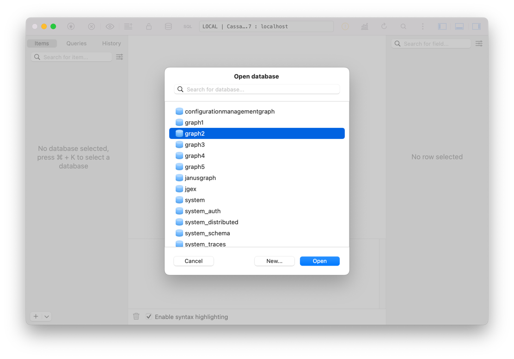

# 如何在JanusGraph里动态创建图。

 基于janusgraph-full-1.0.0/examples修改。

## 配置/conf/gremlin-server/gremlin-server-configuration.yaml

在`ConfigurationManagementGraph`中，增加`ConfigurationManagementGraph`。

```
graphManager: org.janusgraph.graphdb.management.JanusGraphManager
graphs: {
  ConfigurationManagementGraph: conf/janusgraph-cql-configurationgraph.properties
}
```

## 配置conf/JanusGraph-configurationmanagement.properties

```
gremlin.graph=org.janusgraph.core.ConfiguredGraphFactory
storage.backend=cql
graph.graphname=ConfigurationManagementGraph
storage.hostname=127.0.0.1
storage.cql.local-datacenter=datacenter1
```

## 在Docker中运行Cassandra：4.1.7

JanusGraph 1.0.0 在 Cassandra 5中出错。

```
docker run  --volume=/Users/zhangbo/cassandra:/var/lib/cassandra -p 9042:9042 -p 9160:9160 -d cassandra:4.1.7
```

## 运行JanusGraph

```
$JANUSGRAPH_HOME/bin/janusgraph-server.sh start $JANUSGRAPH_HOME/conf/gremlin-server/gremlin-server-configuration.yaml
```

## 运行

两个参数：
* graphName: 打开或新建的图名称，默认值，graph1
* fileName：远程服务配置文件

```
mvn exec:java -pl :TestConfiguredGraph
```

新建图，graph2

```
mvn exec:java -pl :TestConfiguredGraph -Dexec.args="graph2"
```

运行时，首先检查`graph2`是否已经存在：

```
2024-10-05 15:06:49 INFO  [org.example.Main.main()] org.example.Main - No match: graph5
2024-10-05 15:06:49 INFO  [org.example.Main.main()] org.example.Main - No match: graph4
2024-10-05 15:06:49 INFO  [org.example.Main.main()] org.example.Main - No match: graph3
2024-10-05 15:06:49 INFO  [org.example.Main.main()] org.example.Main - No match: graph1
2024-10-05 15:06:50 INFO  [org.example.Main.main()] org.example.Main - result{object=null class=null}
```

不存在，则创建命令，调用`client`执行：
```
s.append("HashMap map = new HashMap<String, Object>();");
s.append("map.put(\"storage.backend\", \"cql\");");
s.append("map.put(\"storage.hostname\", \"127.0.0.1\");");
s.append("map.put(\"graph.graphname\", \"" + this.graphName + "\");");
s.append("ConfiguredGraphFactory.createConfiguration(new MapConfiguration(map));");

final ResultSet resultSet2 = client.submit(s.toString());
```

新建成功后，Cassandra里创建了 `graphe2`


